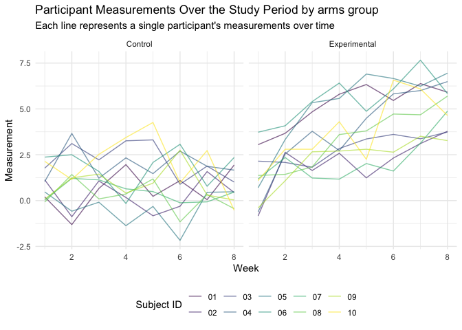
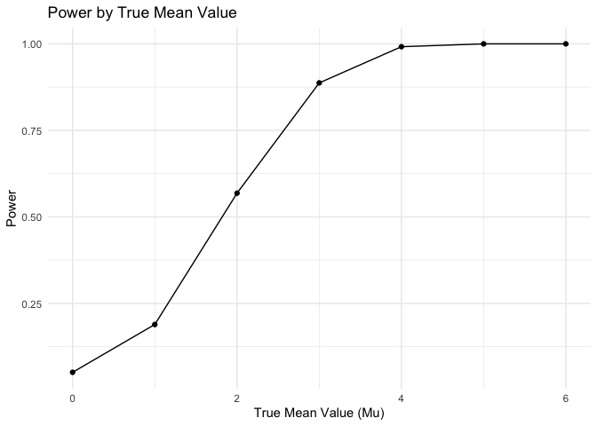
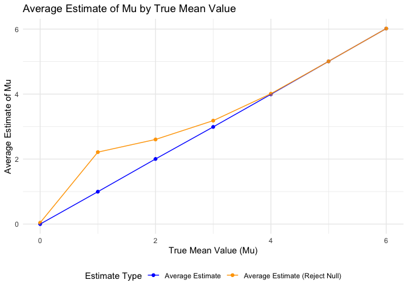

Data Science HW 5
================
Hingling Yu
2023-11-08

## Problem 2

#### Use the `list.files` to create datafrane of file names

``` r
arms_df = 
  tibble(
    files = list.files(path = "data", full.names = TRUE)
    ) 
```

#### Data cleaning and tidying

``` r
tidy_arms_df = 
  arms_df %>% 
  mutate(
    participant_data = map(files, read_csv), # Read in each subject's data from the csv file
    arm_group = ifelse(str_detect(files, "exp"), "Experimental", "Control"), 
    # Determine the arm group from file name
    subject_id = as.factor(str_extract(files, "\\d+"))
  ) %>% 
  unnest(participant_data) %>%  # unnest the participant data into rows
  pivot_longer(
    week_1:week_8, 
    names_to = "week", 
    values_to = "measurements"
  ) %>% #transform the week columns into a "long" format
  mutate(week = parse_number(week)) # convert the week identifier to a numeric value
```

#### Spaghetti plot to visualize measurements for each participant across different time points

``` r
tidy_arms_df %>%
  ggplot(
    aes(x = week, y = measurements, group = subject_id, color = subject_id)
    ) + # ensure lines are drawn for each subject
  geom_line(alpha = 0.6) + # set transparency to distinguish overlapping lines
  facet_wrap(.~ arm_group) + # use facet_wrap to separate the arm groups into different panels
  labs(
    title = "Participant Measurements Over the Study Period by arms group",
    subtitle = "Each line represents a single participant's measurements over time",
    x = "Week",
    y = "Measurement",
    color = "Subject ID"
  )
```

<!-- -->

#### Plot Description and comparison between groups

- The control group does not show a clear trend over time; the lines
  fluctuate up and down without a consistent direction. While, the
  experimental group seems to show a slight upward trend as time
  progresses.
- The experimental group appears to have higher overall measurements
  compared to the control group. While the control group measurements
  are more clustered.
- The experimental group’s lines show more divergence as time
  progresses, suggesting a possible effect of the experimental
  conditions leading to greater individual differences in outcomes.

## Problem 3

#### Set up design elements and functions

``` r
sim_output = function(mu) {
  map_dfr(
    1:5000, 
    ~t.test(rnorm(30, mean = mu, sd = 5), mu = 0, conf.level = 0.95) %>%
      broom::tidy() %>%
      mutate(reject = p.value < 0.05)
  ) %>%
  summarize(
    power = mean(reject),
    mean_estimate = mean(estimate),
    mean_estimate_reject = mean(estimate[reject])
  ) %>%
  mutate(mu = mu) %>%
  select(mu, everything())
}
```

#### For different values of mu

``` r
results = map_dfr(0:6, sim_output)
```

#### Plot the proportion of times the null was rejected (power)

``` r
results %>% 
  ggplot(aes(x = mu, y = power)) +
  geom_point() +
  geom_line() +
  labs(title = "Power by True Mean Value", x = "True Mean Value (Mu)", y = "Power")
```

<!-- -->

#### Plot of the average estimate of mu

``` r
results %>%
  gather(
    key = "estimate_type", 
    value = "estimate_value", 
    mean_estimate, 
    mean_estimate_reject
  ) %>%
  mutate(estimate_type = factor(estimate_type, 
                                levels = c("mean_estimate", "mean_estimate_reject"),
                                labels = c("Average Estimate", "Average Estimate (Reject Null)"))) %>%
  
  ggplot(aes(x = mu, y = estimate_value, color = estimate_type)) +
  geom_point() +
  geom_line() +
  labs(title = "Average Estimate of Mu by True Mean Value",
       x = "True Mean Value (Mu)", y = "Average Estimate of Mu") +
  scale_color_manual(values = c("blue", "orange")) +
  guides(color = guide_legend(title = "Estimate Type"))
```

<!-- -->
